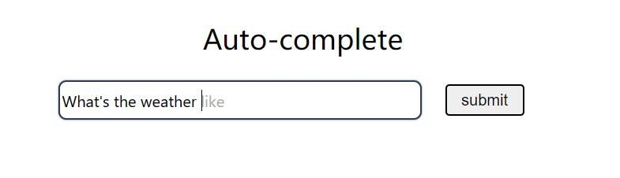
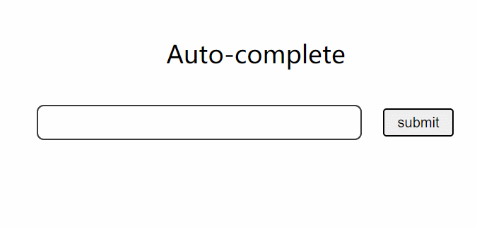
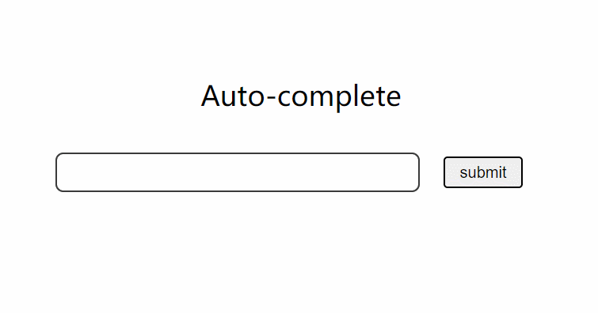

# AutoCompletion Demo   
This is a demo of autocompletion (search bar/ text box).   http://xzifan.github.io/Auto_Complete-demo

  

The suggestion of words and expressions will show up in color grey. With a click of `TAB`, the textfield will complete with the suggestion.  
The vocalbulary is based on what have been submitted. Expressions and words that are submitted can be used for later autocompletion.    

<em>For easier testing, the demo will load [10000 vocabulary](https://raw.githubusercontent.com/first20hours/google-10000-english/master/google-10000-english-no-swears.txt) and 1 expression `"what's the weather like"` by default.</em>  

## Get started  
You can submit some words or expressions. In later input, you'll get suggestions for auto-completion of words if the word is not finished (haven't ended with a `space`). And possible suggestions for expressions when it end with a `space`.  

If you wish to clear the default vocabulary and expression, you can try to click the title **Auto-complete** above the search bar.  

### Auto-Complete Words  

### Auto-Complete Expressions  
